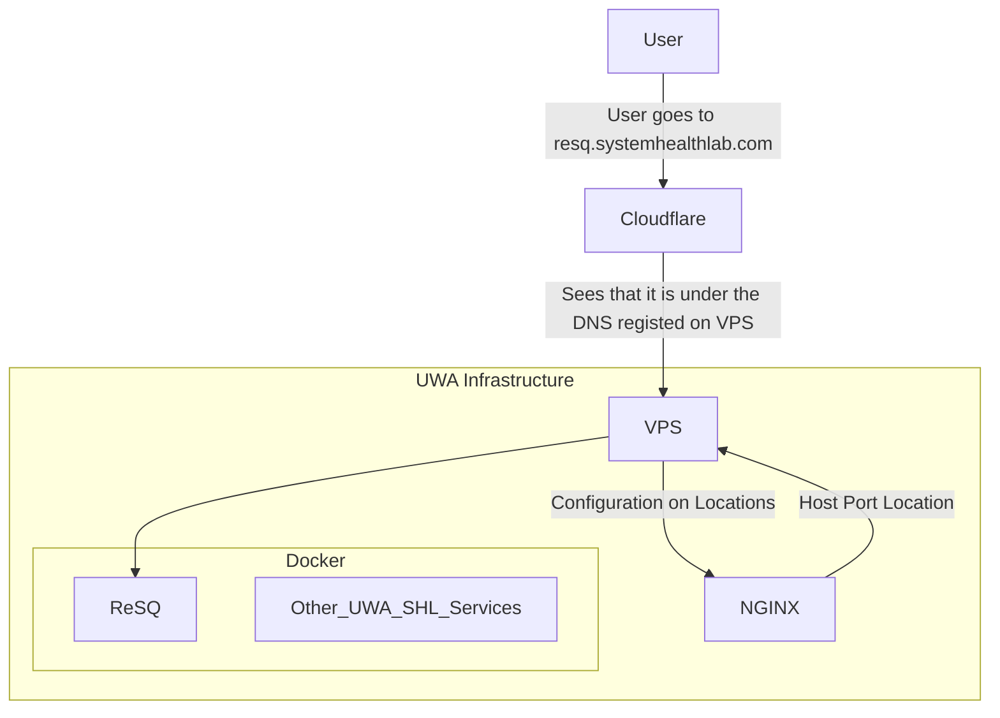

# Deployment
The deployment of ReSQ is in the UWA Infrastructure (to be precise in the [UWA System Health Lab](https://systemhealthlab.com/)). The reason being is that permission is granted to Frinze Erin Lapuz (Software Team Lead of the Redbacks Team at the UWA System Health Lab).

There a couple of steps that were involved in doing this:

## DNS Configuration
**This is a 1 time configuration**

The domain name is set to "resq.systemhealthlab.com" in UWA Cloudflare.

## NGINX Configuration
Using [Binchicken](https://binchicken.systemhealthlab.com/), I have created the NGINX configuration that will handle all requests going to the application (reverse-proxy).

???+ info "Nginx Configuration"
    ```nginx
    server {
        server_name resq.systemhealthlab.com;
        location / {
            proxy_set_header Host $host;
            proxy_set_header X-Real-IP $remote_addr;
            proxy_pass http://localhost:10023;
            proxy_set_header X-Forwarded-Proto $scheme;
            proxy_http_version 1.1;
            proxy_set_header Upgrade $http_upgrade;
            proxy_set_header Connection "upgrade";
            proxy_set_header X-Forwarded-For $proxy_add_x_forwarded_for;
            proxy_read_timeout 3m;
            proxy_send_timeout 3m;
        }

        listen [::]:443 ssl;
        listen 443 ssl;
        ssl_certificate /etc/letsencrypt/live/systemhealthlab.com/fullchain.pem;
        ssl_certificate_key /etc/letsencrypt/live/systemhealthlab.com/privkey.pem;
        include /etc/letsencrypt/options-ssl-nginx.conf;
        ssl_dhparam /etc/letsencrypt/ssl-dhparams.pem;
    }

    server {
        listen 80;
        listen [::]:80;

        server_name
            resq.systemhealthlab.com
            www.resq.systemhealthlab.com;
        return 301 https://resq.systemhealthlab.com$request_uri;
    }
    ```

### Diagrammatic Explanation



## Deployment with Docker Image
This requires access towards the application inside the VPS. The easiest way to do this is to have access with the VPS through SSH (you may need permission for this).

Once you are in there, do
```bash
git pull
```
to pull in the new changes from the `main` branch.

???+ note "`git pull`"
    This assumes that you already have the repository in the VPS. If it does not exist, just do `git clone`.

Then run
```bash
sh deploy.sh
```
This will rebuild all the containers (for production) as well as the new code.