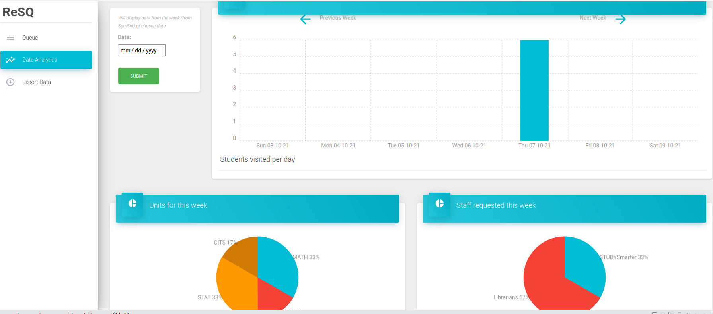

# Data analytics
This website provide some basic data analytics for "at a glance" view.  

There will be 3 charts generated in the Data analytics tab:  

- Students visited per day in the chosen week  
- The percentages of popular units in that week  
- Comparison between students enter STUDYSmarter and Librarian queue in that week  

In order to generate data analytics for a chosen week:  

- Choose an arbitrary day in the week you want to generate data  

- Click submit