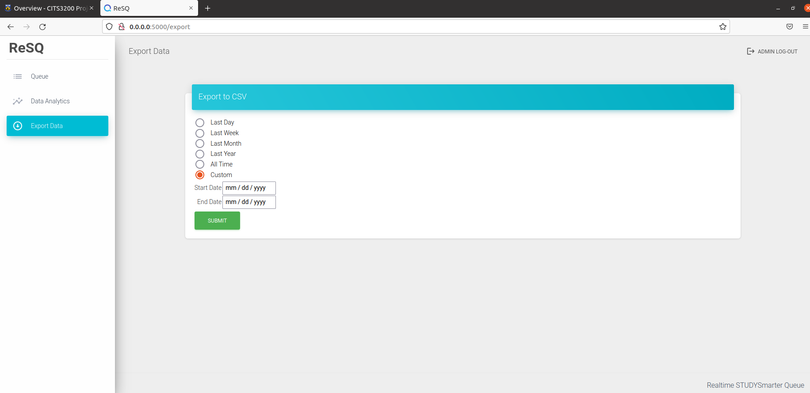

# Export data
If user wants to export data to a csv file for further data analysis: 

- Step 1: Navigate to the 'Export Data' tab  
- Step 2: There are premade options such as "Last week" or "Last Day". You can also choose "Custom" option to export data between a period of your choice 

- Step 3: Click 'Submit', then download the file

