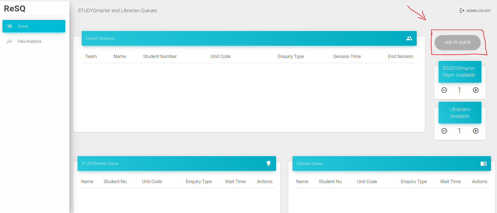
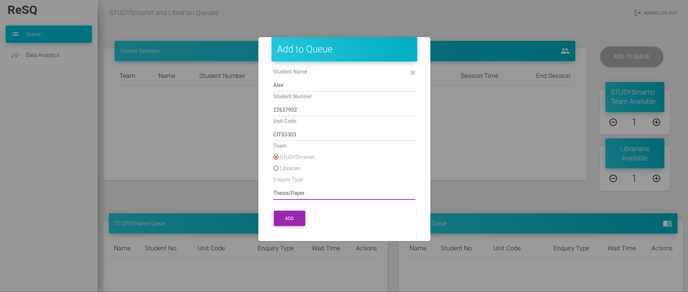

# Functionality

## Add student to waiting queue
Click the "ADD TO QUEUE" button in the top right of the screen

The user can enter student information and choose which queue to add student to.

## Move/Remove students from waiting queue
User can move students from waiting queue to "in Session" table by clicking the green button, or removing them from the queue with the red button

## Finish/Undo a session
When a session is done, user can click the green button to finish the session. 
When user accidentally added a student to "in Session" table from waiting queue, undo it by choosing the undo button 

## Export data
If user wants to export data to a csv file for further data analysis: 
- Step 1: Navigate to the 'Export Data' tab  
- Step 2: Choose the 'start' and 'end' date to get the data between those days  

- Step 3: Click 'Submit', then download the file
