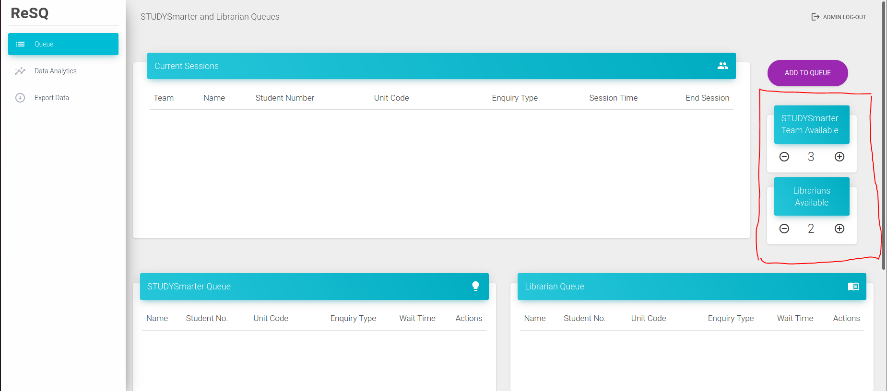
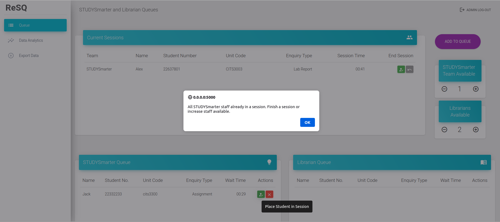
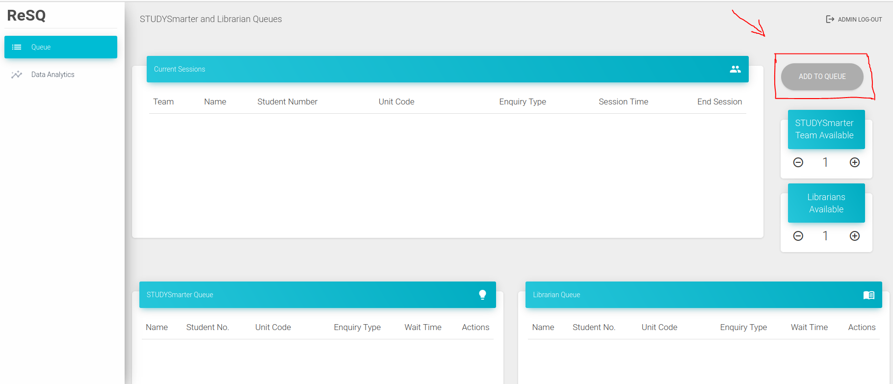
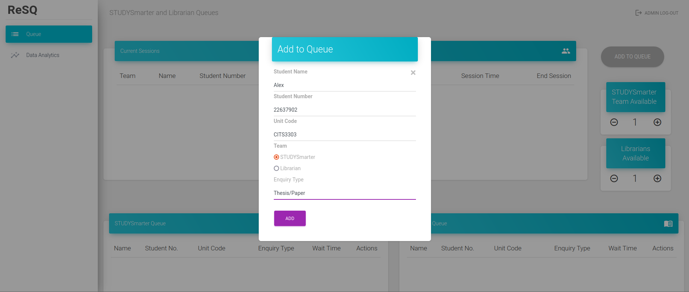
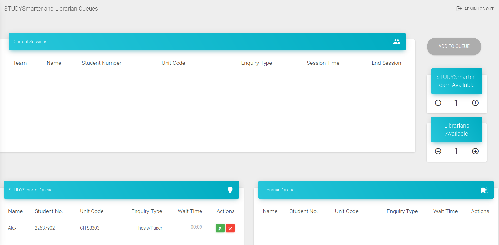
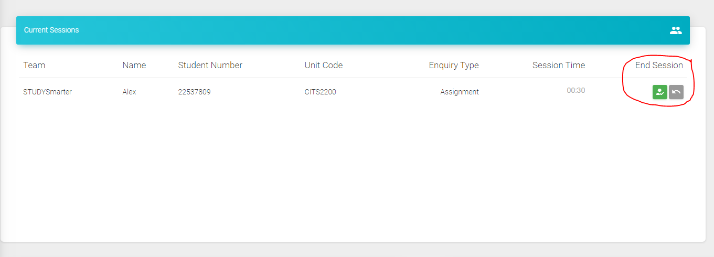
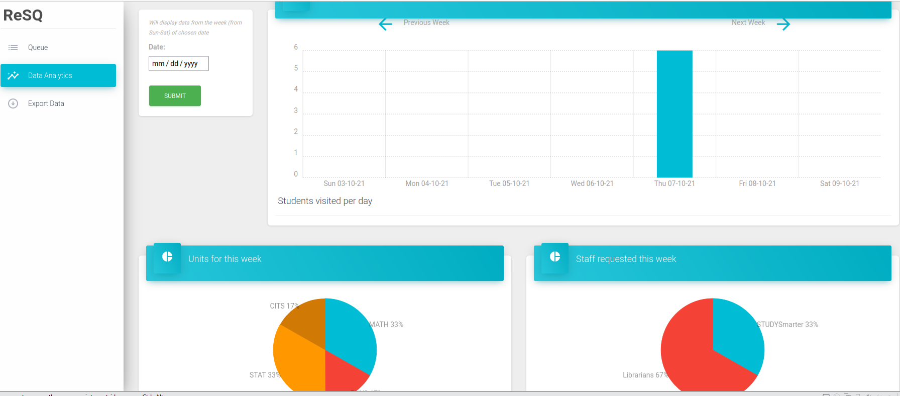
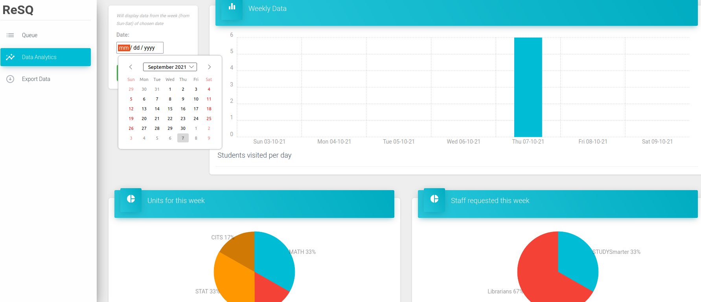
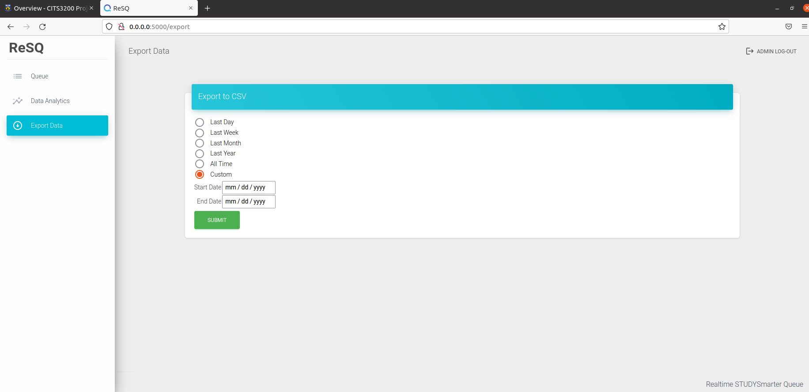

# User Documentation

## How to access the website
Click [here](https://resq.systemhealthlab.com/login?next=%2F) to redirect to the website. User will need username and password to login.  
There will be 3 main tabs in the website, which are Queue, Data Analytics and Export Data

## Queue
User can manage student sessions in the Queue tab. There are 3 tables, 2 of which are STUDYSmarter queue and Librarian queue. Students will be put into either queue depending on user's choice.  
### Staff management
On the right side of the queue home page, you can see 2 small boxes saying "STUDYSmarter Team Available" and "Librarians Available". You can click the "+" and "-" icon to modify the number base on your current available staff.  

If you try to add student to the inSession queue which exceeds your current setup for each staff type, the website will give a warning alert and require you to modify the staff number.

### Add to queue
In order to add a student to a waiting queue, look for the "ADD TO QUEUE" button in the top right corner 

A form will show up as below. In this form, you can enter student information and choose the queue type between "STUDYSmarter" and "Librarian" 

When successfully added, the student information will show up in the corresponding queue. Below is an example

### Managing a session
If you want to move students from either waiting queue to "Current Session" table, click the green button in the "Actions" column  

If a student cancel the appointment, you can remove her/him from the waiting queue by clicking the red button in the "Actions" column  
A message box will show up and ask to confirm your action, click "Yes".  

### Finish/Undo a session
When a session is done, user can click the green button to finish the session. 
When user accidentally added a student to this table from waiting queue, undo it by choosing the undo button 

## Data analytics
This website provide some basic data analytics for "at a glance" view.  

There will be 3 charts generated in the Data analytics tab:  

- Students visited per day in the chosen week  
- The percentages of popular units in that week  
- Comparison between students enter STUDYSmarter and Librarian queue in that week  

In order to generate data analytics for a chosen week:  

- Choose an arbitrary day in the week you want to generate data  

- Click submit
## Export data
If user wants to export data to a csv file for further data analysis: 

- Step 1: Navigate to the 'Export Data' tab  
- Step 2: There are premade options such as "Last week" or "Last Day". You can also choose "Custom" option to export data between a period of your choice 

- Step 3: Click 'Submit', then download the file

